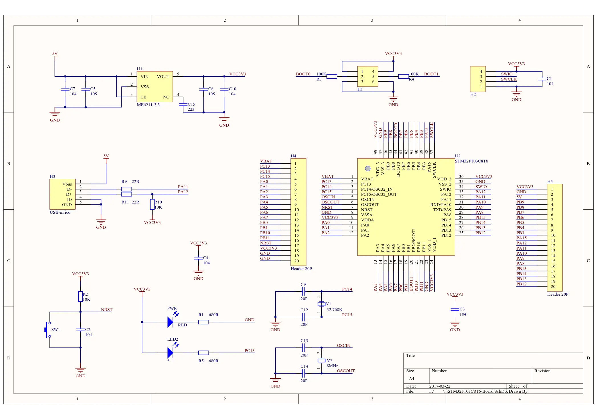
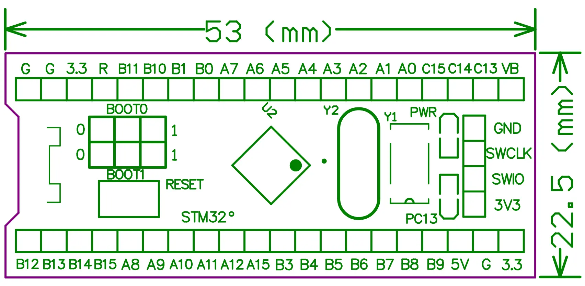

# STM32F103C8T6 学习

看的教程是野火：

- 视频：[【野火】STM32 HAL库开发实战指南 教学视频](https://www.bilibili.com/video/BV18X4y1M763/)
- 书籍：[[野火]STM32 HAL库开发实战指南——基于F103系列开发板](https://doc.embedfire.com/mcu/stm32/f103/hal_general/zh/latest/index.html)

书跟视频内容是一样的，前期感觉可以看看视频进入下状态，后面嫌视频速度慢就可以直接看书了。

野火的 HAL 库这套教程看时间是 2021 年出的，在这之前野火的教程讲的都是标准外设库（standard peripheral library），而且不同的开发版都分别有不同的视频与书籍进行讲解，大部分内容是一致的，但是有很多小区别。

现在都建议看 HAL 库的视频了，因为相比旧的外设库，HAL 库有如下优势：

- 可移植性更高，STM32 全系列的代码都可以通用，不需要做修改。
  - 也因此野火一套教程就 Cover 了自己所有的开发版，不再需要像以前一样每个板子都录一遍视频了。
- 因为底层已经做了一层完全的抽象，上层代码都通用了，HAL 上层为我们提供了更丰富、更复杂的库函数，供我们使用，这能大大提升开发效率。
- STM32 还推出了基于 HAL 的 STM32CubeMX，这是一个代码生成器，可以随便点两下就能生成一套按需定制的样板代码，相当方便。

仔细看的话也能发现野火自己的视频里，STM32 系列就属 HAL 库这个视频播放量最高，所以入门就看它没错的。

另一方面标准外设库目前已经彻底停止更新了，所以现在基本都得用 HAL 库或者第三方的库。

>实际我是看了大半野火 18 年出的 F103 教程，然后才搞明白原来 HAL 这个是最新的，也是入门视频...不过问题不大，内容实际都差不多。

## 开发板

用的开发版是某宝上 13 元一块的 STM32F103C8T6 最小系统板。

板子原理图如下：



PCB 结构尺寸图如下：



STM32 官方的两本手册，日常写程序都需要参照的：

- 数据手册 STM32F103xB datasheet: <http://www.st.com/stonline/products/literature/ds/13587.pdf>
- 参考手册 RM0008 Reference manual: <http://www.st.com/stonline/products/literature/rm/13902.pdf>

## Platformio 开发环境

因为用的是 Linux，入门阶段仍然选用 PlatformIO 作为 IDE 玩耍。

PlatformIO 上支持 stm32 的 framework 有好几个：

1. Arduino: 貌似是 platformio 上最流行的一个 platform，esp32 也可以用，但是还不太了解。
2. [CMSIS](https://github.com/ARM-software/CMSIS_5)(The ARM Cortex Microcontroller Software Interface Standard): ARM 官方推出的一个 Cortex-M 系列处理器的硬件抽象层，各 SOC 之间都通用，不过比较底层。
5. STM32 Standard Peripheral Libraries: 这就是前面提到的 ST 标准外设程序库，野火旧的教程都是基于这个库来讲解的。
   1. 这个库实际也是基于 CMSIS 实现的，而且 ST 官方早就不更新了，现在官方主推 HAL 库，所以现在不建议使用此库了。
6. [STM32Cube](https://github.com/STMicroelectronics/STM32Cube_MCU_Overall_Offer): 这也是 ST 官方开源的一套软件库，包含 HAL 硬件抽象层。别人如果说 STM32 HAL，那就是指这个。
7. [libopencm3](https://github.com/libopencm3/libopencm3): Cortex-M0(+)/M3/M4 系列控制器的开源固件库
8. 其他 RTOS 相关库，先忽略。

貌似目前入门都是直接推荐 STM32Cube HAL 了，所以我选了这个。

## 烧录

我这个最小系统板的 micro usb 接口是没有 ttl 转 usb 功能的，另一侧的 SWIO/SWCLK 这里虽然看着也是 4 个引脚，但是它是给仿真器用的 SWD 接口。

JTAG/SWD 接口都是一种可用于调试、下载程序的接口，需要配合对应的仿真器使用。

查看此项目的 `platformio.ini` 配置，其中有 `upload_protocol`，支持多种协议，简要介绍其中常用的几种：

- serial: 即 TTL 串口，最原始的固件上传协议，上传速度比较慢，而且不支持调试。
- cmsis-dap: 是 ARM 官方的调试协议规范
  - 此标准最流行的用法是开源项目 [ARMmbed/DAPLink](https://github.com/ARMmbed/DAPLink)，它将一块 STM32 板子当成调试器，通过 CMSIS-DAP 协议来调试另一块板子。 
- stlink: ST 意法半导体提出的的调试协议，主要用在 STM32 相关板子上。

这里我主要介绍串口跟 DAP 调试器两种烧录方式。

### 1. Serail 串口烧录

我之前已经玩过一波 ESP8266 跟 51 单片机了，对 TTL 串口烧录比较熟悉。它缺点就是速度比较慢，而且不能用于调试。

根据各种文章介绍，STM32 基本全系列都是用 PA9 PA10 这两个引脚进行串口通信：

- 串口线的 RX 接 STM32 的 PA9，对应我开发板的 A9 引脚
- 串口线的 TX 接 STM32 的 PA10，对应我开发板的 A10 引脚
- 当然接地线也得连一下，随便找个 GND 引脚接一下就行。
- 供电线可连可不连，看你是怎么供电的了。如果是用了别的电源，要注意将两个电源的 GND 接一起，统一 GND 的电位。

然后下载前，还需要对 BOOT 做调整。这两个

| BOOT0 | BOOT1 | MODE  |
| ----- | ----- | ----- |
| 0     | X(0/1 都可)     | 用户 FLASH |
| 1     | 1     | 内部 SRAM  |
| 1     | 0     | 系统存储器（包含出厂预置的 bootloader）   |

其中系统存储器包含了出厂预置的 bootloader，我们需要通过它实现串口自动下载程序，因此需要对 BOOT 做如下调整：

- BOOT0 接 3.3V，即 1
- BOOT1 接 GND，即 0

最后，platformio 对 stm32 平台，默认使用 stlink 进行上传，但是我们现在要使用串口，所以要在 `platform.ini` 中添加 `upload_protocol` 相关参数，修改后内容大致如下：

```ini
[env:learn-STM32F103C8]
platform = ststm32
board = genericSTM32F103C8
framework = stm32cube
# AVAILABLE upload_protocol: blackmagic, cmsis-dap, dfu, jlink, serial, stlink
upload_protocol = serial
```

这样完成后，就可以将 USB 转 TTL 线插入电脑，用 platformio 进行程序烧录了（如果板子一直有上电，还需要按下 RESET 键）。

>串口设备在 Linux 系统中通常被命名为 `/dev/ttyUSB0`.

烧录完成后，需要将 BOOT0 与 BOOT1 都接到 0，再按 RESET 键才能正常启动。

### 2. DAP 调试器烧录

>也有叫它 DAP 仿真器的，但是没理解为什么这么翻译...

跟 TTL 一样，首先还是改 `platform.ini` 添加 `upload_protocol`，但是 DAP 还支持调试功能，因此还可以额外添加 `debug_tool` 指定调试器协议，改完效果大致如下：

```ini
[env:learn-STM32F103C8]
platform = ststm32
board = genericSTM32F103C8
framework = stm32cube
# AVAILABLE upload_protocol: blackmagic, cmsis-dap, dfu, jlink, serial, stlink
upload_protocol = cmsis-dap
# 调试协议也设为 DAP
debug_tool = cmsis-dap
```

然后是接线方式，这个每种调试器的板子设计区别，接线方法会有不同，我用的是合宙的 AIR32F103C8T6 这块板子当调试器，[AIR32F103CBT6 开发版 - 合宙 WIKI](https://wiki.luatos.com/chips/air32f103/board.html) 中有调试方法的大致介绍。

STM32F103C8T6 及其国产替代的芯片引脚都是全兼容的，芯片引脚与在调试中对应的功能如下：

| 引脚   | 功能            |
| ---- | ---------------- |
| PB13 | SWD_CLK          |
| PB14 | SWD_DIO          |
| PB0  | RST复位           |
| PA2  | 虚拟串口的 TX      |
| PA3  | 虚拟串口的 RX      |

以前用过串口的应该知道串口的两个设备接线是反的，TX 接另一块板的 RX，RX 则接另一边的 TX。

而在 DAPLink 调试器中，它是完全一对一连接的，引脚的功能会被 DAPLink 用于对外控制，接线方法具体如下：

- 被调试设备通常都有独立的 SWD_CLK/SWD_DIO 引脚，将刷了 DAPLink 固件的调试板的 PB13 与被调试板的 SWD_CLK 连接，PB14 与被调试板的 SWD_DIO 连接即可。
  - 如果没有专用引脚，估计直接对接到另一块版的 PB13/PB14 对接应该也是完全可行的。
- 调试板的 PB0 与被调试板的 PB0 直接对接即可

总结下，调试时只需要正确连将调试器的上述 PB13、PB14、PB0 与被调试设备的对应引脚相连，即可正常烧录与调试。
为了方便通常也会同时通过调试器的 GND 与 3V3 引脚为被调试设备供电，这样一共就需要连 5 根线。

这样完成后，就可以将 USB 转 TTL 线插入电脑，用 platformio 进行程序烧录了（如果板子一直有上电，还需要按下 RESET 键）。

>DAPLink 设备在 Linux 系统中通常被命名为 `/dev/ttyACM0`.

烧录完成后，需要将 BOOT0 与 BOOT1 都接到 0，再按 RESET 键才能正常启动。

## 第一个程序 - 通过 GPIO 点亮开发板上自带的 LED 测试灯

测试灯旁边的标记是 PC13，结合原理图可知此 LED 的一端接的 3V3 电源，另一端接的是 STM32 的 PC13 引脚，对应 GPIO13。

这里第一个程序通过控制 GPIO13 点亮小灯。为了理解原理，我们直接通过操作最底层的寄存器地址来点灯。

>注：这里使用了 `UL` 后缀表示 unsigned long，根据  [ARM 官方文档 - Basic data types in ARM C and C++](https://developer.arm.com/documentation/dui0375/g/C-and-C---Implementation-Details/Basic-data-types-in-ARM-C-and-C--)，unsigned long 与 unsigned int 都是 4bytes，完全可互换

```c
#include <stm32f103xb.h>

// 根据参考手册 3.2 节，Port C 对应的寄存器地址为: 0x40011000UL
// 再根据参考手册 9.2.4 节，配置 GPIO Output 的寄存器地址偏移量为 0x0C，这样就得到 GPIO 输出寄存器的绝对地址为 0x4001100CUL
#define GPIOC_OUTPUT_PTR (unsigned int *)0x4001100CUL

// 再根据参考手册 9.2.2 一节，配置 GPIO 高位的寄存器地址偏移量为 0x04，这样就得到 GPIO 配置寄存器的绝对地址为 0x40011004UL
#define GPIOC_CONFIG_PTR (unsigned int *)0x40011004UL

// 根据参考手册 3.2 节，RCC 时钟控制寄存器的地址为: 0x40021000UL，且 GPIO 都在 APB2 总线（Bus）上
// 再根据参考手册 7.3.7 节，APB2 的时钟启用寄存器 RCC_APB2ENR 偏移量为 0x18，得到其绝对地址为 0x40021018UL
#define RCC_ENABLE_PTR   (unsigned int *)0x40021018UL

int main(void)
{
  // 为了降低功耗，STM32 默认是关闭了所有外设的。现在我们要用 GPIO，就需要启用对应 Port C 的时钟
  // 根据参考手册 IO port C clock 是由 RCC_APB2ENR 的 4 号 bit （第 5 个）控制的，将它设为 1 即可启用时钟
  *RCC_ENABLE_PTR |= (1 << 4);

  // 还需要将 GPIO 13 端口配置为推挽（push-pull）输出模式，最高输出速率调为 50MHZ
  // 根据官方参考手册，为了实现上述配置，需要将 CNF13 设置为 00，将 MODE13 设为 01
  // MODE13 的起始 bit 号为 20，所以就是将 0b0011 左移 20 位，然后将值赋上去即可
  *GPIOC_CONFIG_PTR |= (0b0011 << 20);

  // 左移 13 位即得到 PC13 的 bit 位
  // 为了将此 bit 设为 0（低电平点亮），我们对地址取反再进行 & 运算
  *GPIOC_OUTPUT_PTR &= ~(1 << 13);

  while (1){};
}
```

使用 platformio 的 [Advanced] - [Verbose Build] 编译时将能观察到，它实际是使用了 `arm-none-eabi-gcc` 来编译的，流程如下：

1. 首先将所有依赖库的代码编译成 .o 文件
2. 然后将用户的 .c 代码编译成 .o 文件
3. 第三步，将 `$HOME/.platformio/packages/framework-stm32cubef1/Drivers/CMSIS/Device/ST/STM32F1xx/Source/Templates/gcc/startup_stm32f103xb.S` 这个启动汇编文件编译输出为 `.pio/build/genericSTM32F103C8/FrameworkCMSISDevice/system_stm32f1xx.o`
4. 将前面启动汇编文件生成的 .o 文件，进一步转换为 `.pio/build/genericSTM32F103C8/libFrameworkCMSISDevice.a` 静态链接库
5. 最后，将前面生成的所有 .o 文件，以及 `startup_stm32f103xb.S` 汇编转换成的 .a 静态链接库链接到一起，生成出最后的固件 `.pio/build/genericSTM32F103C8/firmware.elf`

流程中的 `startup_stm32f103xb.S` 是开发板上电时最先启动的程序，可以理解成 bootloader，它先执行一些必备的动作，然后再调用我们 c 语言写的 main 函数。
详细内容可以直接查看该源码。

## 第二个程序 - 还是点灯，但是更简单了


每次都自己计算寄存器地址与位偏移值太麻烦了，STM32 官方库通过结构体给我们定义了更方便的用法，我们可以利用官方库的定义将上述代码改成如下结构：

>这个结构体的定义原理如果有 C 语言基础的话很好理解，如果不好懂的话可以看看野火的教程，讲得非常细致。

```c
#include <stm32f103xb.h>

int main(void)
{
  // 为了降低功耗，STM32 默认是关闭了所有外设的。现在我们要用 GPIO，就需要启用对应 Port C 的时钟
  // 根据参考手册 IO port C clock 是由 RCC_APB2ENR 控制的，官方仓库直接提供了 RCC_APB2ENR_IOPCEN 用于设置这个 bit 位
  RCC->APB2ENR |= RCC_APB2ENR_IOPCEN;

  // 还需要将 GPIO 13 端口配置为推挽（push-pull）输出模式，最高输出速率调为 50MHZ
  // 根据官方参考手册，为了实现上述配置，需要将 CNF13 设置为 00，将 MODE13 设为 01
  GPIOC->CRH &= ~(GPIO_CRH_CNF13 | GPIO_CRH_MODE13);  // 将 CNF13 与 MODE13 均设为 0b00
  GPIOC->CRH |= (GPIO_CRH_MODE13_0);    // 将 MODE13 的第 0 个比特位设为 1，即将 MODE13 设为 0b01

  // 根据官方参考手册 9.2.4 port output data register
  // 可以通过 ODR 来控制输出值
  // 将 GPIO13 对应的 bit 设为 0，输出低电平
  GPIOC->ODR = ~(1 << 13);

  while (1){};
}
```

最后我们借助 STM32 的 HAL_Delay 函数来实现 LED 灯延时闪烁：

>这里我也试过通过循环来实现软延时，但是不清楚是被编译器优化了还是怎样，没有任何效果...

```c
#include <stm32f1xx_hal.h>

int main(void)
{
  HAL_Init();

  // 为了降低功耗，STM32 默认是关闭了所有外设的。现在我们要用 GPIO，就需要启用对应 Port C 的时钟
  // 根据参考手册 IO port C clock 是由 RCC_APB2ENR 控制的，官方仓库直接提供了 RCC_APB2ENR_IOPCEN 用于设置这个 bit 位
  RCC->APB2ENR |= RCC_APB2ENR_IOPCEN;

  // 还需要将 GPIO 13 端口配置为推挽（push-pull）输出模式，最高输出速率调为 50MHZ
  // 根据官方参考手册，为了实现上述配置，需要将 CNF13 设置为 00，将 MODE13 设为 01
  GPIOC->CRH &= ~(GPIO_CRH_CNF13 | GPIO_CRH_MODE13);  // 将 CNF13 与 MODE13 均设为 0b00
  GPIOC->CRH |= (GPIO_CRH_MODE13_0);    // 将 MODE13 的第 0 个比特位设为 1，即将 MODE13 设为 0b01

  while (1){
    // 根据官方参考手册 9.2.4 port output data register
    // 可以通过 ODR（Output Data Register 的缩写）来控制输出值
    // 将 GPIO13 对应的 bit 设为 0，输出低电平
    GPIOC->ODR = ~(1 << 13);
    HAL_Delay(500);
    // 将 GPIO13 对应的 bit 设为 1，输出高电平
    GPIOC->ODR |= (1 << 13);
    HAL_Delay(500);
  };
}

void SysTick_Handler(void)
{
  HAL_IncTick();
}
```

## 第三个程序 - 还是点灯，但是使用 HAL 库

前面的第二个版本仍然存在一些位操作，代码量多了后可读性仍然不是很好。

实际上 STM32 的 HAL 库做了更彻底的封装，将底层的位操作几乎完全隐藏起来了，使我们写代码就像是在搭积木一样调用各种封装好的函数就 OK 了。
这进一步提升了代码的可维护性。

使用 HAL 的点灯代码如下：

>这个野火的视频也做了细致的分析，一步步从原始寄存器操作优化到 HAL，非常清晰。

```c
// start of include/main.h
#ifndef MAIN_H
#define MAIN_H

#include "stm32f1xx_hal.h"

// LED 接的是 PC13，这里应该使用  GPIOC 这个 port
#define LED_GPIO_PORT             GPIOC
// 同样，也应该启用 GPIOC 的 Clock
#define LED_GPIO_CLK_ENABLE()     __HAL_RCC_GPIOC_CLK_ENABLE()
// LED 所在的引脚为 PC13，对应 C Port 的 13 号引脚
#define LED_PIN                   GPIO_PIN_13


#endif
// end of include/main.h

// ==========================================

// start of src/main.c
#include "main.h"

void LED_Init();

int main(void)
{
  HAL_Init();
  LED_Init();

  while (1)
  {
    // 切换 LED 引脚的状态，原来是 1 就改成 0，原来是 0 就改成 1
    HAL_GPIO_TogglePin(LED_GPIO_PORT, LED_PIN);
    HAL_Delay(1000);
  }
}

void LED_Init()
{
  LED_GPIO_CLK_ENABLE(); // 启用 LED 的 GPIO 端口时钟

  GPIO_InitTypeDef GPIO_InitStruct = {
    Pin: LED_PIN,
    Mode: GPIO_MODE_OUTPUT_PP,
    Pull: GPIO_PULLUP,
    Speed: GPIO_SPEED_HIGH,
  };

  // 初始化 GPIO 对应的 port
  HAL_GPIO_Init(LED_GPIO_PORT, &GPIO_InitStruct);
}

void SysTick_Handler(void)
{
  HAL_IncTick();
}
```


## 如何反汇编找 bug

在没有调试器的情况下，对于入门级的程序，最简单的方法应该就是直接反汇编 .elf 固件。

可以使用 platformio 安装的工具链来干这个活：

```shell
~/.platformio/packages/toolchain-gccarmnoneeabi/bin/arm-none-eabi-objdump -d .pio/build/genericSTM32F103C8/firmware.elf > .pio/firmware.asm
```

但是这个方法需要先懂一点 ARM 汇编...


